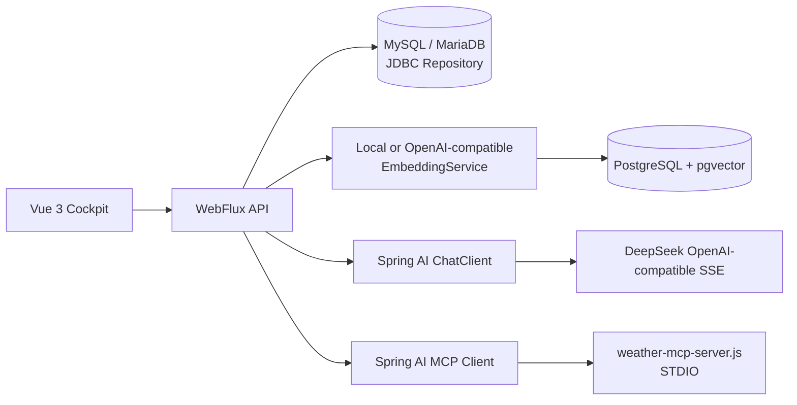

# Enterprise AI Cockpit

企业知识问答与经营分析驾驶舱 Demo。当前版本已经从“内存仓库 + 本地拆分 SSE”改成了可落地的链路：MySQL/MariaDB 持久化业务数据、PostgreSQL + pgvector 保存向量、Spring AI `ChatClient` + WebFlux 输出真实上游流、Spring AI MCP Client 调用天气 STDIO MCP。

## 现在项目做了什么

- 知识库、文档、分块、metadata、数据源、报告运行记录和聊天消息通过 `EnterpriseRepository` 统一访问。
- `APP_REPOSITORY_MODE=mysql` 使用 `JdbcEnterpriseRepository`；`memory` 仍保留给无数据库演示和单元测试。
- 文档导入后使用固定 1536 维 embedding 写入 PostgreSQL `enterprise_ai_vectors`，聊天优先走 pgvector cosine 检索，向量库不可用时回退 MySQL 关键词/CJK 检索。
- Spring AI 1.0.0 的 `ChatClient.stream().content()` 通过 WebFlux 返回 `Flux<ServerSentEvent<String>>`。启用 DeepSeek 后，`token` 事件来自上游 `/chat/completions` 的真实流，不是把完整回答切片。
- MCP Client 通过 `backend/mcp-servers/weather-mcp-server.js` 连接 STDIO 天气服务，提供 `GET /api/mcp/weather?city=常州`，聊天中开启工具并询问天气时也会调用它。
- 前端支持聊天、引用、图表、知识库导入、报告和基础 MCP/向量状态展示。

## 链路结构



## 目录

```text
backend/                         Spring Boot API、RAG、JDBC、WebFlux、MCP
backend/mcp-servers/             天气 MCP STDIO 示例
backend/src/main/resources/     application.yml 与 Flyway 迁移
database/mysql/                  MySQL/MariaDB 建表 SQL
database/postgresql/             pgvector 建表 SQL
frontend/                        Vue 3 管理驾驶舱
credentials.example.txt          脱敏配置模板
credentials/credentials.txt     本机真实配置，已被 .gitignore 排除
```

## 快速启动

环境要求：JDK 17+、Maven 3.9+、Node.js 20+。如果只验证无数据库内存模式：

```powershell
Set-Location E:\codes\enterprise-ai-cockpit\backend
$env:APP_REPOSITORY_MODE = 'memory'
$env:VECTOR_ENABLED = 'false'
$env:LLM_ENABLED = 'false'
mvn spring-boot:run
```

另开终端启动前端：

```powershell
Set-Location E:\codes\enterprise-ai-cockpit\frontend
npm ci
npm run dev
```

## 真实远端数据库配置

真实配置放在本机 `credentials/credentials.txt`，不要把密码写入 YAML、README 或 Git。模板见 [credentials.example.txt](./credentials.example.txt)。远端初始化 SQL 已执行过，后续环境可重复执行：

```powershell
# MySQL/MariaDB
mysql --host <host> --port 3306 --user enterprise_ai_cockpit --password enterprise_ai_cockpit < database/mysql/enterprise_ai_cockpit.sql

# PostgreSQL（需要 pgvector 扩展）
psql --host <host> --port 5432 --username enterprise_ai_cockpit --dbname enterprise_ai_cockpit_vector -f database/postgresql/enterprise_ai_cockpit_vector.sql
```

启动后端时设置：

```powershell
$env:APP_REPOSITORY_MODE = 'mysql'
$env:MYSQL_URL = 'jdbc:mysql://<host>:3306/enterprise_ai_cockpit?useUnicode=true&characterEncoding=utf8&serverTimezone=Asia/Shanghai&useSSL=false&allowPublicKeyRetrieval=true'
$env:MYSQL_USER = 'enterprise_ai_cockpit'
$env:MYSQL_PASSWORD = '<mysql-password>'
$env:VECTOR_ENABLED = 'true'
$env:VECTOR_DATABASE_URL = 'jdbc:postgresql://<host>:5432/enterprise_ai_cockpit_vector'
$env:VECTOR_DATABASE_USER = 'enterprise_ai_cockpit'
$env:VECTOR_DATABASE_PASSWORD = '<postgresql-password>'
mvn spring-boot:run
```

本次远端安装使用 PostgreSQL 11.15 + pgvector 0.4.4（Alibaba Linux 3 的系统 PostgreSQL 版本限制导致没有使用 PGDG 的 PostgreSQL 16 包），因此 SQL 使用 IVFFlat，不依赖 HNSW。2026-07-16 已确认本机可直接访问远端 5432，并以公开地址完成认证、向量写入、检索和删除回归；云安全组应只允许可信源地址，生产优先使用内网或 TLS。

## DeepSeek 与真实 SSE

参考 demo `E:\codes\demo1\backend-spring-ai-alibaba` 的配置已作为本项目本地 credentials 的备用项，代码不读取该文件中的明文。启用 Spring AI：

```powershell
$env:LLM_ENABLED = 'true'
$env:LLM_PROVIDER = 'spring-ai'
$env:OPENAI_BASE_URL = 'https://api.deepseek.com'
$env:OPENAI_API_KEY = '<deepseek-api-key>'
$env:LLM_MODEL = 'deepseek-v4-flash'
```

接口：

- `POST /api/chat`：聚合响应。
- `POST /api/chat/stream`：`meta`、`token`、`references`、`tool`、`chart`、`done` 事件。
- `GET /api/health`：检查 Repository、pgvector 和 MCP 状态。

`LLM_PROVIDER=openai-compatible` 也保留了直接 `WebClient` SSE 网关，便于与非 Spring AI 的 OpenAI-compatible 服务联调。

## MCP 天气测试

```powershell
$env:MCP_ENABLED = 'true'
$env:MCP_WEATHER_SERVER = 'mcp-servers/weather-mcp-server.js'
mvn spring-boot:run

Invoke-RestMethod 'http://localhost:8080/api/mcp/status'
Invoke-RestMethod 'http://localhost:8080/api/mcp/weather?city=常州'
```

## 测试与验证

```powershell
Set-Location E:\codes\enterprise-ai-cockpit\backend
mvn test

Set-Location ..\frontend
npm run build
```

本次已验证：MySQL 新库和 7 张业务表、Flyway 在临时空库中完成 1 个迁移并创建 7 张业务表、PostgreSQL `vector` 扩展与向量表、JDBC 写入、embedding upsert、pgvector 公开地址直连检索、WebFlux SSE、Spring AI + DeepSeek 上游 SSE、MCP 天气、语音 Mock、报告和浏览器端知识库/聊天流程。真实链路测试结果可通过 `/api/health` 看到，例如 `JdbcEnterpriseRepository`、`pgvector=0.4.4` 和已发现的 `queryWeather` 工具。

## 仍需优化

1. **安全**：当前演示仍是 `permitAll`，需要认证、RBAC、租户隔离、审计、密钥托管、CORS 白名单和远端数据库最小权限。
2. **向量质量**：默认 local embedding 是确定性可复现实现，用于验证链路；生产应接入与 1536 维一致的真实 embedding 模型，并增加混合检索、重排、版本和删除补偿任务。
3. **报告**：数据源抽取、cron 任务、重试、锁、幂等和报告模型调用仍是 MVP Mock。
4. **可观测性**：补充 traceId、结构化日志、指标、SSE 断线续传和 API 契约测试。

## 参考

- [Spring AI ChatClient](https://docs.spring.io/spring-ai/reference/api/chatclient.html)
- [Spring AI PGVector](https://docs.spring.io/spring-ai/reference/api/vectordbs/pgvector.html)
- [Spring AI MCP](https://docs.spring.io/spring-ai/reference/api/mcp/mcp-overview.html)
- [DeepSeek API 文档](https://api-docs.deepseek.com/zh-cn/)
- [参考项目与资料](./REFERENCES.md)

## License

[MIT License](./LICENSE)
