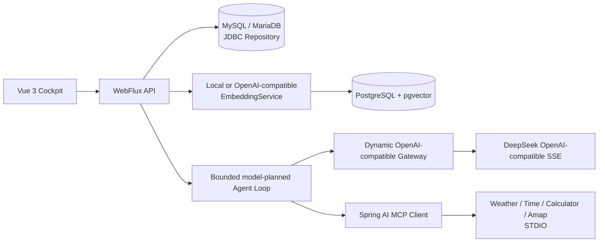

# Enterprise AI Cockpit

企业知识问答与经营分析驾驶舱。当前版本包含可落地的完整链路：
MySQL/MariaDB 持久化业务数据、PostgreSQL + pgvector 保存向量、
DeepSeek OpenAI-compatible API 输出真实 SSE、Spring AI MCP Client 调用
STDIO 工具，以及按业务组织的知识库工作台。

生产环境固定在 `/smartCockpit/`，页面和只读接口公开；聊天、语音、
知识导入、数据源与报告操作由后端签发 30 分钟操作令牌。低内存 Java 17
发布、SSE 代理与回滚说明见
[`docs/production-deployment.md`](docs/production-deployment.md)。

单独开发本项目时只需克隆本仓库，并把私有 `credentials.txt` 放在根目录；
不要求下载 `ai-blog` 或量化项目。项目文件既支持无前缀段，也支持直接复制
含 `cockpit.*` 段的通用凭据。兄弟目录博客凭据只保留为可选兼容回退。

## 现在项目做了什么

- 知识库、文档、分块、metadata、数据源、报告运行记录和聊天消息通过 `EnterpriseRepository` 统一访问。
- `APP_REPOSITORY_MODE=mysql` 使用 `JdbcEnterpriseRepository`；`memory` 仍保留给无数据库演示和单元测试。
- 文档导入后使用固定 1536 维 embedding 写入 PostgreSQL `enterprise_ai_vectors`，聊天优先走 pgvector cosine 检索，向量库不可用时回退 MySQL 关键词/CJK 检索。
- 每次聊天可在 `deepseek-v4-flash` 与 `deepseek-v4-pro` 之间选择；服务端只接受白名单模型 ID，并按请求动态路由。`token` 事件来自上游 `/chat/completions` 的真实流。
- 聊天会带入最近 8 条会话消息；模型先输出结构化意图、地理范围与工具计划，Java 宿主完成授权、schema 校验、依赖编排和有限步执行，并返回规划、引用与 MCP 调用轨迹。
- MCP Client 连接天气/通用工具和高德地图两个 STDIO 服务。高德负责行政区、地理编码和地点搜索，Open-Meteo 接收其权威城市坐标并执行最多 20 城的批量实时天气查询。
- 最终回答使用受控 JSON 协议：正文与图表指令分离，仅允许柱状图、折线图和饼图；天气图表数值由宿主从 MCP 结果绑定，模型不能返回或执行 HTML、Canvas、Chart.js 代码。
- 知识库按业务类型隔离，支持文本和文件导入、元数据、自动分块、MySQL 元数据与 pgvector 生命周期同步；创建、导入和删除等关键操作由 Java 后端短期令牌保护。
- 前端提供 Apple 风格响应式座舱、固定高度且自动滚底的对话区、Enter 发送/Ctrl+Enter 换行、独立知识库工作台、模型/MCP 选择、流式停止、引用查看、多图表、数据源与报告页面。

## 链路结构



## 目录

```text
backend/                         Spring Boot API、RAG、JDBC、WebFlux、MCP
backend/mcp-servers/             天气/通用与高德地图 MCP STDIO 服务
backend/src/main/resources/     application.yml 与 Flyway 迁移
database/mysql/                  MySQL/MariaDB 建表 SQL
database/postgresql/             pgvector 建表 SQL
frontend/                        Vue 3 管理驾驶舱
scripts/remote/deploy_cockpit.py 仅发布座舱的原子远端部署
scripts/deploy.ps1                独立测试、构建与部署入口
scripts/github-push.ps1           独立 token + 20808 代理提交入口
scripts/seed-demo-data.ps1       幂等测试知识库与文档
credentials.example.txt          脱敏配置模板
credentials.txt                  本机真实配置，已被 .gitignore 排除
```

## 快速启动

环境要求：JDK 17+、Maven 3.9+、Node.js 20+。如果只验证无数据库内存模式：

```powershell
Set-Location D:\codes\ai-agent-rag-demo\backend
$env:APP_REPOSITORY_MODE = 'memory'
$env:VECTOR_ENABLED = 'false'
$env:LLM_ENABLED = 'false'
mvn spring-boot:run
```

另开终端启动前端：

```powershell
Set-Location D:\codes\ai-agent-rag-demo\frontend
npm ci
npm run dev
```

## 真实远端数据库配置

真实配置放在本机忽略的 `credentials.txt`，不要把密码写入 YAML、README
或 Git，模板见 [credentials.example.txt](./credentials.example.txt)。
`run-dev.ps1` 会自动注入 MySQL、PostgreSQL、DeepSeek、Amap、embedding
和操作口令配置。

不启动进程、只验证共享映射时运行：

```powershell
pwsh -File run-dev.ps1 `
  -CredentialsPath .\credentials.txt -ValidateConfigOnly
```
远端初始化 SQL 已执行过，后续环境可重复执行：

```powershell
# MySQL/MariaDB
mysql --host <host> --port 3306 --user enterprise_ai_cockpit --password enterprise_ai_cockpit < database/mysql/enterprise_ai_cockpit.sql

# PostgreSQL（需要 pgvector 扩展）
psql --host <host> --port 5432 --username enterprise_ai_cockpit --dbname enterprise_ai_cockpit_vector -f database/postgresql/enterprise_ai_cockpit_vector.sql
```

启动后端时设置：

```powershell
$env:APP_REPOSITORY_MODE = 'mysql'
$env:MYSQL_URL = 'jdbc:mysql://<host>:3306/enterprise_ai_cockpit?useUnicode=true&characterEncoding=utf8&serverTimezone=Asia/Shanghai&useSSL=false&allowPublicKeyRetrieval=true'
$env:MYSQL_USER = 'enterprise_ai_cockpit'
$env:MYSQL_PASSWORD = '<mysql-password>'
$env:VECTOR_ENABLED = 'true'
$env:VECTOR_DATABASE_URL = 'jdbc:postgresql://<host>:5432/enterprise_ai_cockpit_vector'
$env:VECTOR_DATABASE_USER = 'enterprise_ai_cockpit'
$env:VECTOR_DATABASE_PASSWORD = '<postgresql-password>'
mvn spring-boot:run
```

本次远端安装使用 PostgreSQL 11.15 + pgvector 0.4.4（Alibaba Linux 3 的系统 PostgreSQL 版本限制导致没有使用 PGDG 的 PostgreSQL 16 包），因此 SQL 使用 IVFFlat，不依赖 HNSW。2026-07-16 已确认本机可直接访问远端 5432，并以公开地址完成认证、向量写入、检索和删除回归；云安全组应只允许可信源地址，生产优先使用内网或 TLS。

## DeepSeek 与真实 SSE

真实密钥只通过进程环境注入。生产推荐使用支持按请求切换模型的
OpenAI-compatible 网关：

```powershell
$env:LLM_ENABLED = 'true'
$env:LLM_PROVIDER = 'openai-compatible'
$env:OPENAI_BASE_URL = 'https://api.deepseek.com'
$env:OPENAI_API_KEY = '<deepseek-api-key>'
$env:LLM_MODEL = 'deepseek-v4-flash'
```

接口：

- `POST /api/chat`：聚合响应。
- `POST /api/chat/stream`：`meta`、`plan`、`tool`、`token`、`references`、零到多个 `chart`、`done` 事件。工具状态会先于模型正文返回，便于界面及时展示调用结果。
- `GET /api/chat/options`：可选模型与 MCP 工具目录。
- `GET /api/health`：检查 Repository、pgvector 和 MCP 状态。

请求体的 `model` 仅允许 `deepseek-v4-flash` 和 `deepseek-v4-pro`。
不传时使用 `LLM_MODEL`；Pro 使用更高的输出预算以容纳推理阶段。

## MCP 工具测试

```powershell
$env:MCP_ENABLED = 'true'
$env:MCP_WEATHER_SERVER = 'mcp-servers/weather-mcp-server.js'
$env:MCP_AMAP_SERVER = 'mcp-servers/amap-mcp-server.js'
$env:AMAP_MAPS_API_KEY = '<amap-web-service-key>'
$env:MCP_REQUEST_TIMEOUT = '30s'
mvn spring-boot:run

Invoke-RestMethod 'http://localhost:8080/api/mcp/status'
Invoke-RestMethod 'http://localhost:8080/api/mcp/tools'
Invoke-RestMethod 'http://localhost:8080/api/mcp/weather?city=常州'
```

天气 MCP 对 Open-Meteo 的瞬时网络错误和 `408/425/429/5xx` 响应执行有限重试，
保留 2 分钟新鲜缓存，并在上游短时不可用时最多使用 30 分钟内的最近成功结果。
省级批量天气先由模型选择高德行政区工具，再把返回的城市名和中心坐标绑定到一次
天气调用；国家范围由模型同时规划本地展示名与国际通用查询名，不依赖省名或国家名硬编码。
生产环境应为 STDIO server 配置绝对路径；工具失败时聊天链路会返回明确的
`tool=error` 并安全降级，不会把实时天气失败误报成“知识库没有信息”。

## 测试与验证

```powershell
Set-Location D:\codes\ai-agent-rag-demo\backend
mvn test

Set-Location ..\frontend
npm run build

Set-Location ..
.\scripts\verify-weather-flow.ps1
```

发布前应验证：Java 单元/上下文测试、前端类型检查与生产构建、真实
DeepSeek Flash/Pro SSE、MCP 工具、MySQL Flyway、pgvector 行数，以及浏览器端
验证弹窗、知识库和聊天流程。远端状态可通过 `/api/health` 查看。

## 仅发布座舱与演示数据

完成本地构建后，从 PowerShell 7 调用座舱专用发布脚本。它只重启
`enterprise-ai-cockpit.service`，不会重启 Nginx、量化或跨境服务；健康检查
失败会切回上一 release：

```powershell
pwsh -File scripts\deploy.ps1 -BuildOnly
pwsh -File scripts\deploy.ps1

pwsh -File scripts\github-push.ps1 `
  -Message 'fix: describe the change' `
  -Files @('path/to/changed-file')
```

若新机器尚无 `.deploy/action-auth.json`，脚本会从本项目凭据的
`[platform.action] password` 生成本机签名密钥，无需复制旧机器的 `.deploy`。

测试数据脚本不会包含口令，需从忽略的本地配置注入当前进程，并按知识库
代码和文档标题幂等写入。文章源文件位于 `demo-data/knowledge/`；首次完整执行
会得到 3 个业务知识库、17 篇文档和 29 个自动向量化分块：

```powershell
$env:ACTION_PASSWORD = '<operation-password>'
pwsh -File scripts\seed-demo-data.ps1
Remove-Item Env:ACTION_PASSWORD
```

## 仍需优化

已完成项、遗留风险和建议优先级见
[`docs/project-review-2026-07-30.md`](docs/project-review-2026-07-30.md)。

## 参考

- [Spring AI ChatClient](https://docs.spring.io/spring-ai/reference/api/chatclient.html)
- [Spring AI PGVector](https://docs.spring.io/spring-ai/reference/api/vectordbs/pgvector.html)
- [Spring AI MCP](https://docs.spring.io/spring-ai/reference/api/mcp/mcp-overview.html)
- [DeepSeek API 文档](https://api-docs.deepseek.com/zh-cn/)
- [参考项目与资料](./REFERENCES.md)

## License

[MIT License](./LICENSE)
